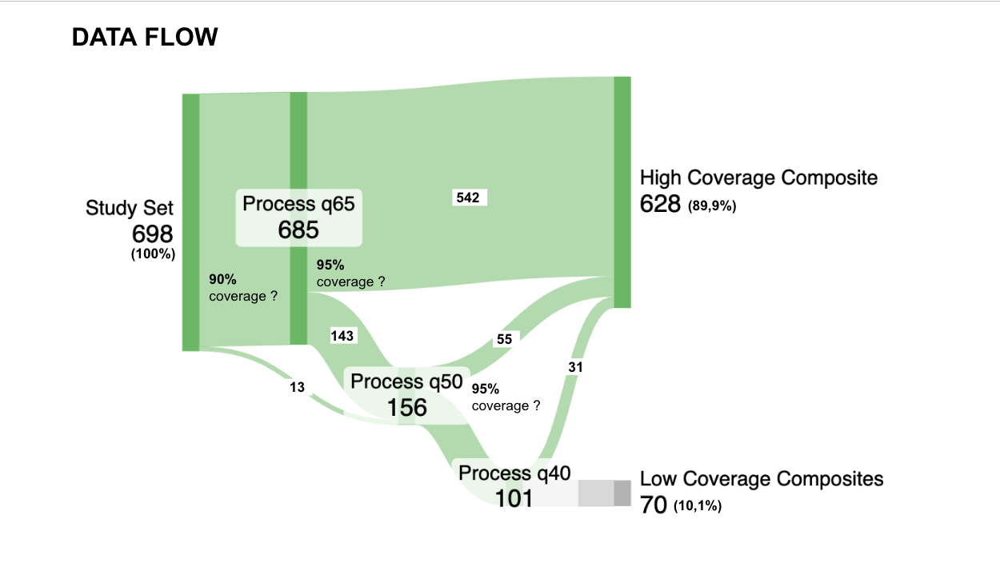
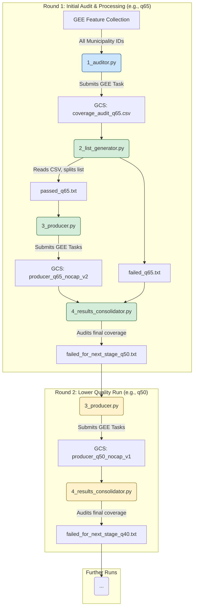

## The Challenge
Comparing satellite imagery across years (2019 vs 2023) requires strict consistency. However, persistent cloud cover in the Colombian Andes and Pacific coast makes standard cloud-masking strategies fail, leaving massive "holes" (no data) in the images.

## The Solution: "The Waterfall Strategy"
Instead of a single "one-size-fits-all" processing run, this pipeline uses an **iterative quality degradation** strategy. 
1.  **Attempt 1 (q65):** We first try to generate composites using strict quality rules (Cloud Prob < 35%).
2.  **Attempt 2 (q50):** For municipalities that fail (too many holes), we loosen the rules (Cloud Prob < 50%).
3.  **Attempt 3 (q40):** For the hardest cases, we accept more haze (Cloud Prob < 60%) to ensure at least *some* data exists.
4.  **Final Selection:** A smart selector script picks the best "Stable" version for each municipality, prioritizing quality but ensuring temporal consistency between years.

***
## 📈 Workflow Overview


## 📂 Repository Structure

```text
s2_composites_col/
├── src/
│   ├── 1_coverage_auditor.py      # Step 1: Feasibility check
│   ├── 2_list_generator.py        # Step 2: Input list creation
│   ├── 3_composite_producer.py    # Step 3: Main GEE Export Engine
│   ├── 4_post_processing_manager.py # Step 4: QC & Cleanup
│   ├── 7_candidate_selector.py    # Step 5: The Waterfall Logic
│   └── 8_master_json_generator.py # Step 6: Final Indexing
├── config/
│   └── municipalities.txt         # Target IDs
└── requirements.txt               # Dependencies (uv/pip)
```

***

## 🚀 The Pipeline Steps

### 1. Audit (`1_coverage_auditor.py`)
**"Is it even possible?"** 
Queries the entire study area to estimate if enough clear pixels exist to make a valid composite. It produces a "Pass/Fail" CSV report before we waste time exporting images.

### 2. Produce (`3_composite_producer.py`)
**"The Factory"** 
The core engine. It takes a list of IDs and submits thousands of tasks to Earth Engine.
*   **Algorithm:** It uses a custom "Dry/wet Season" logic (NDMI windowing) to ensure 2019 and 2023 images are from comparable seasons.
*   **Output:** Exports GeoTIFFs and Metadata JSONs to Google Cloud Storage.

### 3. Quality Control (`4_post_processing_manager.py`)
**"The Gatekeeper"** 
After a production run, this script scans the output metadata.
*   **Pass:** >95% Coverage? Stay in the main folder.
*   **Fail:** <95% Coverage? Move to `low_coverage/` folder and flag for the next round (with lower quality settings).

### 4. The Waterfall Selection (`7_candidate_selector.py`)
**"The Decision Maker"** 
Once all 3 rounds (q65, q50, q40) are done, this script analyzes the difficult cases. It applies a **Strict Waterfall Logic**:
*   Is `q65` (High Quality) stable across both years? **Pick it.**
*   If not, is `q50` (Medium Quality) stable? **Pick it.**
*   If not, fallback to `q40`.

### 5. Master Indexing (`8_master_json_generator.py`)
**"The Source of Truth"** 
Scans the entire bucket and consolidates the ~700 municipalities into a single JSON file.
*   Handles **Tiled Images** automatically (groups multiple files per ID).
*   Embeds all metadata (coverage stats, area).
*   Provides a clean lookup table for downstream analysis.

***

## 🛠 Setup & Installation

This project uses `uv` for fast dependency management.

1.  **Clone the repo:**
    ```bash
    git clone https://github.com/gregmaya/s2_composites_col.git
    cd s2_composites_col
    ```

2.  **Set up environment:**
    ```bash
    uv venv
    source .venv/bin/activate
    uv pip install -r requirements.txt
    ```

3.  **Authentication:**
    *   Place your Google Cloud Service Account key in the root as `earthengineapikey.json`.
    *   *(Note: This file is git-ignored for security).*

***

## 📊 Key Metadata
Each composite comes with a sidecar `.geojson` containing:
*   `final_coverage_2019`: % of valid pixels.
*   `dryness_lower_percentile`: The seasonal threshold used.
*   `q_score`: The quality tier (q65/q50/q40).

***

**Author:** Greg Maya  
**License:** [MIT/CC-BY/etc]

Sources

## Workflow Diagram


